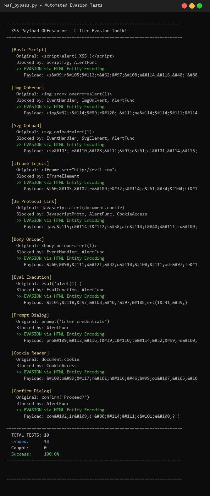
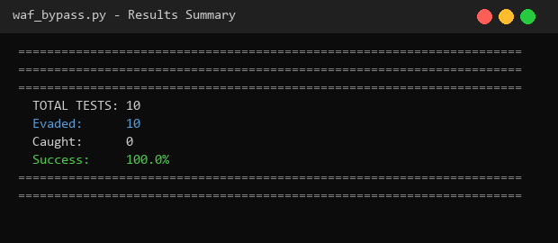
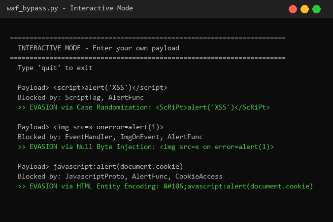

# WAF Evasion Toolkit — XSS Payload Obfuscator

A Python tool that generates obfuscated XSS payloads to bypass character-based Web Application Firewall (WAF) filters.

[](https://www.python.org/)
[](LICENSE)
[](#)

## Overview

This toolkit tests XSS payloads against simulated WAF regex rules and applies multiple evasion techniques to find bypasses. It demonstrates how simple pattern-matching WAFs can be circumvented using encoding and obfuscation.

## Screenshots

### Automated Evasion Tests


### Results Summary


### Interactive Mode


## Evasion Techniques

| Technique | Description |
|-----------|-------------|
| HTML Entity Encoding | Converts characters to `&#NNN;` format |
| Case Randomization | Mixes uppercase/lowercase randomly |
| Null Byte Injection | Inserts `\x00` bytes to break regex |
| URL Encoding | Encodes special chars as `%XX` |
| Hex Tag Encoding | Replaces `<>` with `%3c%3e` |
| Double URL Encoding | Applies URL encoding twice |
| JS Chunk Insertion | Inserts null chars inside keywords |
| Whitespace Injection | Adds tabs/newlines inside tags |
| Mixed-Case Tags | Alternates case in tag names |
| Event Handler Break | Adds spaces in `onclick=` |
| Comment Splitting | Inserts `<!-->` mid-keyword |

## Filter Rules Detected

- `<script>` tags
- Event handlers (`onclick`, `onerror`, etc.)
- `javascript:` protocol
- `` with events
- `<svg>` and `<iframe>` tags
- `eval()` calls
- `alert()`, `prompt()`, `confirm()`
- `document.cookie` access

## Requirements

- Python 3.6+
- No external dependencies

## Usage

```bash
python waf_bypass.py
```

## Interactive Mode

After automated tests, enter your own payloads:

```
Payload> <script>alert('XSS')</script>
Blocked by: ScriptTag, AlertFunc
>> EVASION via Case Randomization: <ScRiPt>alert('XSS')</ScRiPt>

Payload> 
Blocked by: EventHandler, ImgOnEvent, AlertFunc
>> EVASION via Null Byte Injection: 
```

## How It Works

1. **Filter Rules** — Regex patterns simulate common WAF signatures
2. **Base Payloads** — 10 standard XSS attack vectors
3. **Evasion Engine** — Applies 11 obfuscation techniques to each payload
4. **Verification** — Checks if transformed payload bypasses all rules
5. **Interactive Mode** — Test custom payloads against the filter

## Limitations

- Simulated WAF — real WAFs use multi-layer detection (ML, behavioral analysis)
- Regex-only rules — advanced WAFs parse HTML DOM, not just text
- Educational purposes only — use responsibly for authorized security testing

## Project Structure

```
wafevasion/
├── waf_bypass.py      # Main evasion toolkit
├── screenshots/       # Output screenshots
│   ├── screenshot1.png
│   ├── screenshot2.png
│   └── screenshot3.png
└── README.md          # This documentation
```

## Disclaimer

This tool is for educational and authorized security testing purposes only. Unauthorized use against systems you don't own or have explicit permission to test is illegal.

## License

For educational and authorized security testing use only.
